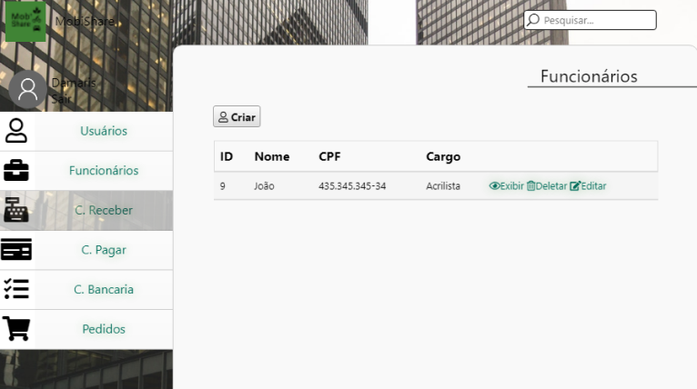

# Desktop

 Um sistema desktop para ajudar a gerir a empresa e o dilheiro vindo das locações.

## Bibliotecas

* [Electron.js](https://www.electronjs.org) - Plataforma para desenvovimento Desktop com Html, CSS e JS.
* [Jquery](https://jquery.com) - Biblioteca JS para agilizar a codificação em JS
* [JqueryUI](https://jqueryui.com) - Biblioteca de components visuais
* [html-pdf](https://www.npmjs.com/package/html-pdf) - Biblioteca para trabalhar com geração de PDF
